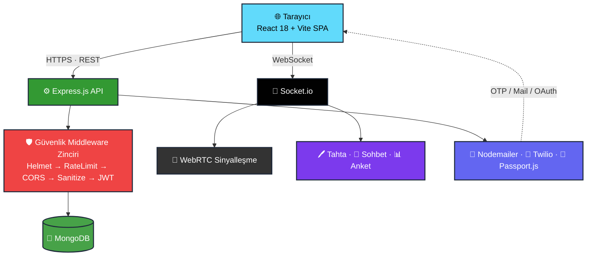

<!-- ═══════════════════════════════════════════════════════════════════════ -->
<!--                                  HERO                                    -->
<!-- ═══════════════════════════════════════════════════════════════════════ -->

<div align="center">


<!-- Tagline -->
<p>
  <strong>🎥 WebRTC Canlı Dersler &nbsp;·&nbsp; 🔐 Çok Katmanlı Kimlik Doğrulama &nbsp;·&nbsp; 🏆 Oyunlaştırma &nbsp;·&nbsp; 💼 Kurumsal B2B</strong>
</p>

<p><em>Gerçek zamanlı eğitim deneyimini üretim kalitesinde güvenlikle birleştiren full-stack SaaS platformu.</em></p>

<!-- ── Status badges ── -->
<p>
  
  
  
  
</p>

<!-- ── Nav ── -->
<p>
  <a href="#-içindekiler"></a>
  <a href="#-hızlı-başlangıç"></a>
  <a href="#-api-referansı"></a>
  <a href="#-güvenlik-mimarisi"></a>
</p>

</div>

<br/>

<!-- ── Highlight stats ── -->
<div align="center">

| ⚡ Gerçek Zamanlı | 🔐 Auth Yöntemi | 🛡️ Güvenlik Katmanı | 📄 Sayfa | 🔌 API Endpoint |
|:---:|:---:|:---:|:---:|:---:|
| **WebRTC + Socket.io** | **4 farklı** | **7+** | **20+** | **30+** |

</div>

<br/>

<!-- ═══════════════════════════════════════════════════════════════════════ -->

## 📖 İçindekiler

<table>
<tr>
<td valign="top" width="50%">

1. [🌟 Neden EduVerse?](#-neden-eduverse)
2. [✨ Özellikler](#-özellikler)
3. [🧰 Teknoloji Yığını](#-teknoloji-yığını)
4. [🏗 Mimari](#-mimari)
5. [📂 Proje Yapısı](#-proje-yapısı)

</td>
<td valign="top" width="50%">

6. [🚀 Hızlı Başlangıç](#-hızlı-başlangıç)
7. [🔌 API Referansı](#-api-referansı)
8. [🛡️ Güvenlik Mimarisi](#-güvenlik-mimarisi)
9. [🧪 Test Hesapları](#-test-hesapları)
10. [📜 Komutlar & Katkı](#-npm-komutları)

</td>
</tr>
</table>

<br/>

<!-- ═══════════════════════════════════════════════════════════════════════ -->

## 🌟 Neden EduVerse?

> Mevcut eğitim platformları çoğunlukla **tek yönlü** ve **etkileşimsizdir.** EduVerse bu denklemi değiştirir.

<table>
<tr>
<td width="33%" align="center" valign="top">


### Gerçekten Canlı

Kayıtlı video değil — WebRTC ile **gecikmesiz** çift yönlü video, ortak beyaz tahta ve canlı kod laboratuvarı.

</td>
<td width="33%" align="center" valign="top">


### Erişilebilir Giriş

E-posta yok mu? Sorun değil. **Telefon numarasıyla** kayıt ve şifresiz SMS girişi. Google ile tek tık.

</td>
<td width="33%" align="center" valign="top">


### Güvenlik Önce

bcrypt, SHA-256 token, JWT, rate-limit, NoSQL injection koruması — **endüstri standardı** sertleştirme.

</td>
</tr>
</table>

<br/>

<!-- ═══════════════════════════════════════════════════════════════════════ -->

## ✨ Özellikler

<table>
<tr>
<td width="50%" valign="top">

#### 🔐 Kimlik Doğrulama &nbsp; `v2.0 YENİ`
`📧` **E-posta OTP** — kayıtta 6 haneli kod maile gider
`🔁` **Şifremi Unuttum** — SHA-256 hash'li güvenli link
`📱` **Telefon Kayıt & Giriş** — SMS OTP, şifresiz
`🌐` **Google / LinkedIn OAuth** — anında + hoş geldin maili
`🔒` **Şifre Sıfırlama** — güç göstergesi + eşleşme kontrolü
`🎚️` **E-posta ↔ Telefon** SVG sliding-pill seçici

</td>
<td width="50%" valign="top">

#### 🚀 Canlı Ders Altyapısı
`🎥` **WebRTC + Socket.io** — düşük gecikmeli video/ses
`💬` Gerçek zamanlı **sohbet · anket · el kaldırma**
`🖊️` Çok kullanıcılı eşzamanlı **Beyaz Tahta**
`💻` Canlı **Kod Laboratuvarı** (JS / Python / HTML)
`🪄` AI destekli arka plan kaldırma & bulanıklaştırma
`🎤` Seminer modu: Host / Speaker / Attendee

</td>
</tr>
<tr>
<td width="50%" valign="top">

#### 🏆 Oyunlaştırma & Topluluk
`⭐` **XP puanı**, seviye sistemi, rozet koleksiyonu
`🚩` **CTF** güvenlik laboratuvarları + skor tablosu
`💭` Forum gönderileri, yorumlar, beğeniler
`📡` **Topluluk Sayfası** — gerçek zamanlı akış

</td>
<td width="50%" valign="top">

#### 🗺️ Kariyer & Verimlilik
`🧭` Full Stack · Data Science · DevOps **yol haritaları**
`⏱️` Görev bazlı **Pomodoro** sayacı
`📅` **Takvim** entegrasyonlu çalışma planı
`🎖️` **QR doğrulamalı** tamamlama sertifikaları

</td>
</tr>
<tr>
<td width="50%" valign="top">

#### 💼 Kurumsal & Ödeme
`🏢` **B2B kurumsal** plan & giriş sayfası
`🛒` Sanal ödeme akışı (sepet → checkout)
`📝` **Eğitmen başvuru** sistemi (admin onaylı)
`📈` Gelir & öğrenci takip paneli

</td>
<td width="50%" valign="top">

#### 🛡️ Güvenlik & Altyapı
`🪖` Helmet · CORS · Rate limit · sanitize
`🔐` **JWT** + bcrypt (salt:12) + SHA-256
`📜` Winston + Morgan **loglama** (14 gün)
`👑` Tam **Admin Paneli** — kullanıcı, kurs, başvuru

</td>
</tr>
</table>

<br/>

<!-- ═══════════════════════════════════════════════════════════════════════ -->

## 🧰 Teknoloji Yığını

<div align="center">


</div>

<br/>

| Katman | Teknolojiler | Notlar |
|:---|:---|:---|
| 🎨 **Frontend** |   | Vanilla CSS design-system · Context API · Lucide React |
| ⚙️ **Backend** |   | asyncHandler · Joi validasyon · Passport.js |
| 🍃 **Veritabanı** |   | Sparse unique index (email & phone) |
| 📡 **Gerçek Zamanlı** |   | Simple-peer · Perfect Negotiation pattern |
| 📧 **E-posta / SMS** |   | HTML şablonlar · console-log fallback |
| 🌐 **OAuth** |   | Passport stratejileri · `isVerified:true` otomatik |
| 🛡️ **Güvenlik** |   | bcrypt · rate-limit · mongo-sanitize · SHA-256 |

<br/>

<!-- ═══════════════════════════════════════════════════════════════════════ -->

## 🏗 Mimari

<div align="center">



</div>

<br/>

<!-- ═══════════════════════════════════════════════════════════════════════ -->

## 📂 Proje Yapısı

<details>
<summary><b>📁 Klasör ağacını görüntüle</b> &nbsp;<kbd>tıkla</kbd></summary>

<br/>

```
EduVerse/
│
├── 📂 backend/
│   ├── config/
│   │   ├── db.js                  # MongoDB bağlantısı (pool + timeout)
│   │   ├── env.js                 # Ortam değişkeni doğrulama
│   │   └── passport.js            # Google & LinkedIn OAuth stratejileri
│   ├── middleware/
│   │   ├── auth.js                # authenticate + authorize
│   │   ├── validate.js            # Joi şema fabrikası (+ phone şemaları)
│   │   ├── asyncHandler.js
│   │   └── errorHandler.js
│   ├── models/
│   │   └── User.js                # phone, isPhoneVerified, passwordReset* alanları
│   ├── routes/
│   │   ├── auth.js                # 11 endpoint: kayıt, giriş, OTP, OAuth, sıfırlama
│   │   ├── admin.js · courses.js
│   │   ├── payment.js             # CLIENT_URL / BACKEND_URL env-var'a taşındı
│   │   └── upload.js              # BACKEND_URL env-var'a taşındı
│   ├── socket/
│   │   ├── handlers/              # webrtc, whiteboard, chat, poll, seminar
│   │   └── roomManager.js
│   ├── utils/
│   │   ├── email.js               # verifyEmail / welcome / resetPassword şablonları
│   │   ├── sms.js                 # Twilio wrapper + fallback
│   │   └── logger.js
│   ├── .env                       # ← GİT'E EKLENMEDİ (gizli)
│   ├── .env.example               # ← Şablon (taahhüt edildi)
│   └── server.js
│
├── 📂 frontend/
│   └── src/
│       ├── context/
│       │   ├── AuthContext.jsx    # registerPhone, loginPhone, forgotPassword…
│       │   └── ThemeContext · CartContext · ToastContext
│       ├── views/
│       │   ├── LoginView.jsx      # E-posta/Telefon tab + şifremi unuttum
│       │   ├── RegisterView.jsx   # E-posta/Telefon tab + OTP doğrulama
│       │   ├── ResetPasswordView.jsx   ← YENİ
│       │   ├── SettingsView.jsx · LiveSessionView.jsx
│       │   ├── admin/AdminDashboardView.jsx
│       │   └── instructor/InstructorDashboardView.jsx
│       ├── services/api.js        # registerPhone, verifyPhone, forgotPassword…
│       └── App.jsx                # reset-password route + ToastProvider
│
├── 📂 docs/
│   ├── CHANGELOG.md
│   └── Guvenlik_ve_Test_Raporu.md
│
├── projeakisi.md                  # Haftalık rapor ve ekip katkıları
├── .gitignore
└── README.md
```

</details>

<br/>

<!-- ═══════════════════════════════════════════════════════════════════════ -->

## 🚀 Hızlı Başlangıç

<div align="center">


</div>

#### 1️⃣ &nbsp; Backend

```bash
cd backend

cp .env.example .env          # Ortam değişkenlerini hazırla
# .env içinde en az şunları doldur:
#   MONGO_URI · JWT_SECRET · SMTP_USER · SMTP_PASS · CLIENT_URL

npm install
npm run db:seed               # örnek verilerle DB'yi doldur (önerilen)
npm run dev                   # 🟢 http://localhost:5000
```

#### 2️⃣ &nbsp; Frontend

```bash
cd frontend

cp .env.example .env          # VITE_API_URL=http://localhost:5000/api

npm install
npm run dev                   # 🟢 http://localhost:5173
```

> ⚠️ &nbsp;**İki sunucu da aynı anda çalışmalıdır.** &nbsp;Backend `5000`, Frontend `5173` portunu kullanır.

<details>
<summary>📱 &nbsp;<b>SMS yapılandırması (opsiyonel — Twilio)</b></summary>

<br/>

```env
# backend/.env
TWILIO_ACCOUNT_SID=ACxxxxxxxxxxxxxxxxxxxxxxxxxxxxx
TWILIO_AUTH_TOKEN=xxxxxxxxxxxxxxxxxxxxxxxxxxxxxxxx
TWILIO_PHONE_NUMBER=+1XXXXXXXXXX
```

Twilio yapılandırılmadığında SMS mesajları terminale `[SMS-TEST]` olarak yazdırılır — geliştirme ortamı kesintisiz çalışır. Ücretsiz hesap: **[twilio.com/try-twilio](https://twilio.com/try-twilio)**

</details>

<br/>

<!-- ═══════════════════════════════════════════════════════════════════════ -->

## 🔌 API Referansı

#### 🔐 Kimlik Doğrulama

| Method | Endpoint | Açıklama |
|:---:|:---|:---|
|  | `/api/auth/register` | E-posta ile kayıt + OTP gönderimi |
|  | `/api/auth/verify-email` | E-posta OTP doğrulama |
|  | `/api/auth/login` | E-posta / şifre girişi → JWT |
|  | `/api/auth/register-phone` | 📱 Telefon ile kayıt + SMS OTP |
|  | `/api/auth/verify-phone` | 📱 Telefon OTP doğrulama |
|  | `/api/auth/send-phone-otp` | 📱 OTP yeniden gönder |
|  | `/api/auth/login-phone` | 📱 Şifresiz telefon girişi |
|  | `/api/auth/forgot-password` | 🔁 Şifre sıfırlama maili gönder |
|  | `/api/auth/reset-password/:token` | 🔁 Yeni şifre belirle |
|  | `/api/auth/google` | 🌐 Google OAuth başlat |
|  | `/api/auth/linkedin` | 🌐 LinkedIn OAuth başlat |

<details>
<summary><b>📚 Kurslar · 🛠 Admin · 🌐 Topluluk endpoint'lerini görüntüle</b></summary>

<br/>

**📚 Kurslar & Kullanıcılar**

| Method | Endpoint | Açıklama |
|:---:|:---|:---|
|  | `/api/courses` | Kurs listesi (filtreli & sayfalı) |
|  | `/api/users/me` | Aktif kullanıcı profili |
|  | `/api/users/me` | Profil güncelle |
|  | `/api/upload/profile-picture` | Profil fotoğrafı yükle |

**🛠 Admin**

| Method | Endpoint | Açıklama |
|:---:|:---|:---|
|  | `/api/admin/stats` | Platform istatistikleri |
|  | `/api/admin/users` | Tüm kullanıcılar |
|  | `/api/admin/users/:id/role` | Rol değiştir |
|  | `/api/admin/applications/instructors` | Bekleyen eğitmen başvuruları |
|  | `/api/admin/applications/instructors/:id/approve` | Başvuru onayla |

**🌐 Topluluk & Sertifikalar**

| Method | Endpoint | Açıklama |
|:---:|:---|:---|
|  | `/api/community` | Forum gönderileri |
|  | `/api/community` | Yeni gönderi |
|  | `/api/community/:id/like` | Beğen / Beğeniyi geri al |
|  | `/api/certificates/me` | Kendi sertifikalarım |
|  | `/api/certificates/verify/:certId` | QR doğrulama |

</details>

<br/>

<!-- ═══════════════════════════════════════════════════════════════════════ -->

## 🛡️ Güvenlik Mimarisi

Her HTTP isteği, handler'a ulaşmadan **7 katmanlı bir savunma zincirinden** geçer:

```
  📥 HTTP İstek
       │
  ①  🪖  Helmet ─────────── 11 güvenlik başlığı (HSTS, CSP, X-Frame-Options…)
       │
  ②  ⏱️  Rate Limiter ───── Global: 100/15dk  │  Auth: 20/15dk  (brute-force koruması)
       │
  ③  🌐  CORS ───────────── Yalnızca CORS_ORIGINS whitelist'indeki originler
       │
  ④  🧹  mongo-sanitize ─── $ ve . operatörlerini temizler (NoSQL injection)
       │
  ⑤  ✅  Joi Validasyon ─── Şema dışı alanlar stripUnknown ile çıkarılır
       │
  ⑥  🔑  JWT Authenticate ─ Bearer token doğrulama
       │
  ⑦  👤  Role Authorize ─── student / teacher / admin erişim kontrolü
       │
  ✨  asyncHandler ───────── Tüm async hatalar yakalanır → Global errorHandler
```

| 🔐 Özellik | Detay |
|:---|:---|
| **Şifre Hashing** | bcrypt salt:12 — düz metin **asla** saklanmaz |
| **Reset Token** | `crypto.randomBytes(32)` → SHA-256 hash DB'de; ham token hiç saklanmaz |
| **SMS OTP** | 6 haneli rastgele kod, **10 dakika** geçerli |
| **E-posta OTP** | 6 haneli rastgele kod, **24 saat** geçerli |
| **JWT Secret** | **96 karakterlik** kriptografik rastgele değer |
| **Ortam Ayrımı** | `.env` asla commit edilmez; `.env.example` şablon olarak takip edilir |

<br/>

<!-- ═══════════════════════════════════════════════════════════════════════ -->

## 🧪 Test Hesapları

`npm run db:seed` çalıştırdıktan sonra hazır gelir:

| Rol | E-posta | Şifre | Erişim |
|:---:|:---|:---|:---|
| 👑 **Admin** | `admin@demo.com` | `Demo12345!` | Tam yönetim paneli |
| 🎓 **Eğitmen** | `teacher@demo.com` | `Demo12345!` | Eğitmen paneli + kurs yönetimi |
| 📖 **Öğrenci** | `student@demo.com` | `Demo12345!` | Kurslar, canlı dersler, ödevler |

> 💡 **Eğitmen Başvurusu** &nbsp;→&nbsp; Kayıtta *"Eğitmen Olarak Başvur"* işaretle, admin hesabıyla onayla.  
> 💡 **Canlı Ders Testi** &nbsp;→&nbsp; İki farklı sekme aç (biri Eğitmen, biri Öğrenci); WebRTC otomatik bağlanır.  
> 💡 **Telefon Girişi** &nbsp;→&nbsp; Twilio yoksa OTP terminal çıktısına yazdırılır (`[SMS-TEST]`).

<br/>

<!-- ═══════════════════════════════════════════════════════════════════════ -->

## 📜 NPM Komutları

| Dizin | Komut | Açıklama |
|:---|:---|:---|
| `backend` | `npm run dev` | 🔧 Nodemon ile geliştirme sunucusu |
| `backend` | `npm run db:seed` | 🌱 Veritabanını örnek veriyle doldur |
| `backend` | `npm run db:backup` | 💾 MongoDB yedeği al |
| `backend` | `npm run db:restore` | ♻️ Yedekten geri yükle |
| `frontend` | `npm run dev` | ⚡ Vite geliştirme sunucusu |
| `frontend` | `npm run build` | 📦 Production bundle (1833 modül · 0 hata) |
| `frontend` | `npm run preview` | 👀 Production build önizlemesi |

<br/>

## 🤝 Katkıda Bulunma

```bash
git checkout -b feature/<ozellik-adi>     # 1️⃣ Yeni dal aç
git commit -m "feat: açıklama"            # 2️⃣ Değişiklikleri commit et
git push origin feature/<ozellik-adi>     # 3️⃣ Push et ve PR aç
```

> **Commit formatı:** &nbsp;`feat:` · `fix:` · `refactor:` · `docs:` · `chore:` &nbsp;|&nbsp; `main` dalı koruma altındadır.

<br/>

<!-- ═══════════════════════════════════════════════════════════════════════ -->
<!--                                 FOOTER                                   -->
<!-- ═══════════════════════════════════════════════════════════════════════ -->

<div align="center">

<br/>

### 🎓 EduVerse &nbsp;—&nbsp; *Öğrenmeyi yeniden tanımlıyoruz.*

<p>
  <a href="https://github.com/enesaladagg/EduVerse">
    
  </a>
  
  
</p>

<sub>EduVerse Ekibi tarafından inşa edildi · 2026</sub>

<a href="#-içindekiler"><br/><b>⬆ Başa Dön</b></a>


</div>
