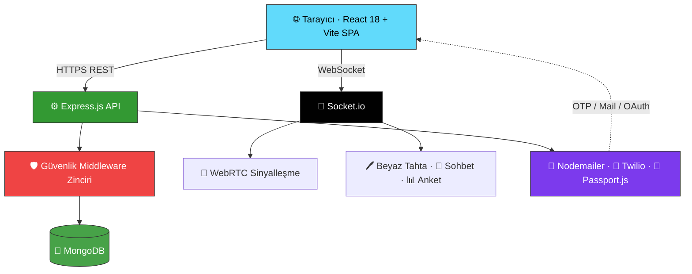

<!-- ░░░░░░░░░░░░░░░░░░░░░░░░░  HERO  ░░░░░░░░░░░░░░░░░░░░░░░░░ -->
<div align="center">

<a href="https://github.com/enesaladagg/EduVerse">
  
</a>

<br/>

<!-- Tagline -->
### 🎓 Canlı dersler · 🔐 Çok katmanlı kimlik doğrulama · 🏆 Oyunlaştırma · 💼 Kurumsal B2B

<em>WebRTC tabanlı gerçek zamanlı eğitim deneyimini, üretim kalitesinde güvenlikle birleştiren full-stack SaaS platformu.</em>

<br/><br/>

<!-- Live status badges -->
<p>
  
  
  
  
</p>

<!-- Tech badges -->
<p>
  
  
  
  
  
  
  
  
</p>

<!-- Nav -->
<p>
  <a href="#-neden-eduverse">Neden EduVerse?</a> &nbsp;•&nbsp;
  <a href="#-özellikler">Özellikler</a> &nbsp;•&nbsp;
  <a href="#-mimari">Mimari</a> &nbsp;•&nbsp;
  <a href="#-hızlı-başlangıç">Hızlı Başlangıç</a> &nbsp;•&nbsp;
  <a href="#-api-referansı">API</a> &nbsp;•&nbsp;
  <a href="#-güvenlik-mimarisi">Güvenlik</a> &nbsp;•&nbsp;
  <a href="#-test-hesapları">Test</a>
</p>

</div>

<br/>

<!-- Highlight stats strip -->
<div align="center">

| ⚡ Gerçek Zamanlı | 🔐 Auth Yöntemi | 🛡️ Güvenlik Katmanı | 📄 Sayfa | 🔌 API Endpoint |
|:---:|:---:|:---:|:---:|:---:|
| WebRTC + Socket.io | **4 farklı** | **7+** | **20+** | **30+** |

</div>

---

## 🌟 Neden EduVerse?

> Mevcut eğitim platformları **tek yönlü** ve **etkileşimsiz**. EduVerse bunu değiştiriyor.

<table>
<tr>
<td width="33%" align="center" valign="top">

### 🎥
**Gerçekten Canlı**

Kayıtlı video değil — WebRTC ile **gecikmesiz** çift yönlü video, ortak beyaz tahta ve canlı kod laboratuvarı.

</td>
<td width="33%" align="center" valign="top">

### 🔑
**Erişilebilir Giriş**

E-posta yok mu? Sorun değil. **Telefon numarasıyla** kayıt ve şifresiz SMS girişi. Google ile tek tık.

</td>
<td width="33%" align="center" valign="top">

### 🛡️
**Güvenlik Önce**

bcrypt, SHA-256 token, JWT, rate-limit, NoSQL injection koruması — **endüstri standardı** sertleştirme.

</td>
</tr>
</table>

---

## ✨ Özellikler

<table>
<tr>
<td width="50%" valign="top">

### 🔐 Kimlik Doğrulama &nbsp;`v2.0 YENİ`
- 📧 **E-posta OTP** — kayıtta 6 haneli kod maile gider
- 🔁 **Şifremi Unuttum** — SHA-256 hash'li güvenli link
- 📱 **Telefon ile Kayıt & Giriş** — SMS OTP, şifresiz
- 🌐 **Google / LinkedIn OAuth** — anında + hoş geldin maili
- 🔒 **Şifre Sıfırlama Sayfası** — güç göstergesi + eşleşme
- 🎚️ **E-posta ↔ Telefon** SVG sliding-pill seçici

</td>
<td width="50%" valign="top">

### 🚀 Canlı Ders Altyapısı
- 🎥 **WebRTC + Socket.io** — düşük gecikmeli video/ses
- 💬 Gerçek zamanlı **sohbet · anket · el kaldırma**
- 🖊️ Çok kullanıcılı eşzamanlı **Beyaz Tahta**
- 💻 Canlı **Kod Laboratuvarı** (JS / Python / HTML)
- 🪄 AI destekli arka plan kaldırma & bulanıklaştırma
- 🎤 Seminer modu: Host / Guest Speaker / Attendee

</td>
</tr>
<tr>
<td width="50%" valign="top">

### 🏆 Oyunlaştırma & Topluluk
- ⭐ **XP puanı**, seviye sistemi ve rozet koleksiyonu
- 🚩 **CTF** güvenlik laboratuvarları + skor tablosu
- 💭 Forum gönderileri, yorumlar, beğeniler
- 📡 **Topluluk Sayfası** — gerçek zamanlı canlı akış

</td>
<td width="50%" valign="top">

### 🗺️ Kariyer & Verimlilik
- 🧭 Full Stack · Data Science · DevOps **yol haritaları**
- ⏱️ Görev bazlı **Pomodoro** sayacı
- 📅 **Takvim** entegrasyonlu çalışma planı
- 🎖️ **QR doğrulamalı** tamamlama sertifikaları

</td>
</tr>
<tr>
<td width="50%" valign="top">

### 💼 Kurumsal & Ödeme
- 🏢 **B2B kurumsal** plan & giriş sayfası
- 🛒 Sanal ödeme akışı (sepet → checkout)
- 📝 **Eğitmen başvuru** sistemi (admin onaylı)
- 📈 Gelir & öğrenci takip paneli

</td>
<td width="50%" valign="top">

### 🛡️ Güvenlik & Altyapı
- 🪖 Helmet · CORS whitelist · Rate limit · sanitize
- 🔐 **JWT** + bcrypt (salt:12) + SHA-256 hashing
- 📜 Winston + Morgan **loglama** (14 gün rotasyon)
- 👑 Tam **Admin Paneli** — kullanıcı, kurs, başvuru

</td>
</tr>
</table>

---

## 🏗 Mimari

<div align="center">



</div>

### 🧰 Tech Stack

| Katman | Teknoloji | Notlar |
|:---|:---|:---|
| 🎨 **Frontend** | React 18, Vite, Lucide React | Vanilla CSS design-system, Context API |
| ⚙️ **Backend** | Node.js, Express.js, asyncHandler | Joi validasyon, Passport.js |
| 🍃 **Veritabanı** | MongoDB 7, Mongoose | Sparse unique index (email & phone) |
| 📡 **Gerçek Zamanlı** | Socket.io 4, Simple-peer (WebRTC) | Perfect Negotiation pattern |
| 📧 **E-posta** | Nodemailer + Gmail SMTP | HTML şablonlar (OTP, reset, hoş geldin) |
| 📱 **SMS** | Twilio SDK | Console-log fallback (dev modunda) |
| 🌐 **OAuth** | Passport Google 2.0, LinkedIn | `isVerified:true` otomatik |
| 🛡️ **Güvenlik** | JWT, bcryptjs, Helmet, rate-limit, sanitize | SHA-256 token hash |
| 📜 **Loglama** | Winston (dosya rotasyonu), Morgan | 14 gün saklama |

---

## 📂 Proje Yapısı

<details>
<summary><b>📁 Klasör ağacını görüntüle</b> (tıkla)</summary>

<br/>

```
EduVerse/
│
├── 📂 backend/
│   ├── config/
│   │   ├── db.js                  # MongoDB bağlantısı (pool + timeout)
│   │   ├── env.js                 # Ortam değişkeni doğrulama
│   │   └── passport.js            # Google & LinkedIn OAuth stratejileri
│   ├── middleware/
│   │   ├── auth.js                # authenticate + authorize
│   │   ├── validate.js            # Joi şema fabrikası (+ phone şemaları)
│   │   ├── asyncHandler.js
│   │   └── errorHandler.js
│   ├── models/
│   │   └── User.js                # phone, isPhoneVerified, passwordReset* alanları
│   ├── routes/
│   │   ├── auth.js                # 11 endpoint: kayıt, giriş, OTP, OAuth, sıfırlama
│   │   ├── admin.js · courses.js
│   │   ├── payment.js             # CLIENT_URL / BACKEND_URL env-var'a taşındı
│   │   └── upload.js              # BACKEND_URL env-var'a taşındı
│   ├── socket/
│   │   ├── handlers/              # webrtc, whiteboard, chat, poll, seminar
│   │   └── roomManager.js
│   ├── utils/
│   │   ├── email.js               # verifyEmail / welcome / resetPassword şablonları
│   │   ├── sms.js                 # Twilio wrapper + fallback
│   │   └── logger.js
│   ├── .env                       # ← GİT'E EKLENMEDİ (gizli)
│   ├── .env.example               # ← Şablon (taahhüt edildi)
│   └── server.js
│
├── 📂 frontend/
│   └── src/
│       ├── context/
│       │   ├── AuthContext.jsx    # registerPhone, loginPhone, forgotPassword…
│       │   ├── ThemeContext.jsx · CartContext.jsx · ToastContext.jsx
│       ├── views/
│       │   ├── LoginView.jsx      # E-posta/Telefon tab + şifremi unuttum
│       │   ├── RegisterView.jsx   # E-posta/Telefon tab + OTP doğrulama
│       │   ├── ResetPasswordView.jsx   ← YENİ
│       │   ├── SettingsView.jsx · LiveSessionView.jsx
│       │   ├── admin/AdminDashboardView.jsx
│       │   └── instructor/InstructorDashboardView.jsx
│       ├── services/api.js        # registerPhone, verifyPhone, forgotPassword…
│       └── App.jsx                # reset-password route + ToastProvider
│
├── 📂 docs/
│   ├── CHANGELOG.md
│   └── Guvenlik_ve_Test_Raporu.md
│
├── projeakisi.md                  # Haftalık rapor ve ekip katkıları
├── .gitignore
└── README.md
```

</details>

---

## 🚀 Hızlı Başlangıç

> 📋 **Gereksinimler:** Node.js `v18+` · MongoDB `v6+` (yerel ya da Atlas) · npm `v9+`

### 1️⃣ Backend

```bash
cd backend

cp .env.example .env          # Ortam değişkenlerini hazırla
# .env içinde en az şunları doldur:
#   MONGO_URI, JWT_SECRET, SMTP_USER, SMTP_PASS, CLIENT_URL

npm install
npm run db:seed               # örnek verilerle DB'yi doldur (önerilen)
npm run dev                   # 🟢 http://localhost:5000
```

### 2️⃣ Frontend

```bash
cd frontend

cp .env.example .env          # VITE_API_URL=http://localhost:5000/api

npm install
npm run dev                   # 🟢 http://localhost:5173
```

> ⚠️ **İki sunucu da aynı anda çalışmalıdır.** Backend `5000`, Frontend `5173` portunu kullanır.

<details>
<summary>📱 <b>SMS yapılandırması (opsiyonel — Twilio)</b></summary>

<br/>

```env
# backend/.env
TWILIO_ACCOUNT_SID=ACxxxxxxxxxxxxxxxxxxxxxxxxxxxxx
TWILIO_AUTH_TOKEN=xxxxxxxxxxxxxxxxxxxxxxxxxxxxxxxx
TWILIO_PHONE_NUMBER=+1XXXXXXXXXX
```

Twilio yapılandırılmadığında SMS mesajları terminale `[SMS-TEST]` olarak yazdırılır — geliştirme ortamı kesintisiz çalışmaya devam eder. Ücretsiz hesap: [twilio.com/try-twilio](https://twilio.com/try-twilio)

</details>

---

## 📡 API Referansı

### 🔐 Kimlik Doğrulama

| Method | Endpoint | Açıklama |
|:---|:---|:---|
| `POST` | `/api/auth/register` | E-posta ile kayıt + OTP gönderimi |
| `POST` | `/api/auth/verify-email` | E-posta OTP doğrulama |
| `POST` | `/api/auth/login` | E-posta / şifre girişi → JWT |
| `POST` | `/api/auth/register-phone` | 📱 Telefon ile kayıt + SMS OTP |
| `POST` | `/api/auth/verify-phone` | 📱 Telefon OTP doğrulama |
| `POST` | `/api/auth/send-phone-otp` | 📱 OTP yeniden gönder |
| `POST` | `/api/auth/login-phone` | 📱 Şifresiz telefon girişi |
| `POST` | `/api/auth/forgot-password` | 🔁 Şifre sıfırlama maili gönder |
| `POST` | `/api/auth/reset-password/:token` | 🔁 Yeni şifre belirle |
| `GET`  | `/api/auth/google` | 🌐 Google OAuth başlat |
| `GET`  | `/api/auth/linkedin` | 🌐 LinkedIn OAuth başlat |

<details>
<summary><b>📚 Kurslar · 🛠 Admin · 🌐 Topluluk endpoint'lerini görüntüle</b></summary>

<br/>

**📚 Kurslar & Kullanıcılar**

| Method | Endpoint | Açıklama |
|:---|:---|:---|
| `GET` | `/api/courses` | Kurs listesi (filtreli & sayfalı) |
| `GET` | `/api/users/me` | Aktif kullanıcı profili |
| `PUT` | `/api/users/me` | Profil güncelle |
| `POST` | `/api/upload/profile-picture` | Profil fotoğrafı yükle |

**🛠 Admin**

| Method | Endpoint | Açıklama |
|:---|:---|:---|
| `GET` | `/api/admin/stats` | Platform istatistikleri |
| `GET` | `/api/admin/users` | Tüm kullanıcılar |
| `PUT` | `/api/admin/users/:id/role` | Rol değiştir |
| `GET` | `/api/admin/applications/instructors` | Bekleyen eğitmen başvuruları |
| `PUT` | `/api/admin/applications/instructors/:id/approve` | Başvuru onayla |

**🌐 Topluluk & Sertifikalar**

| Method | Endpoint | Açıklama |
|:---|:---|:---|
| `GET` | `/api/community` | Forum gönderileri |
| `POST` | `/api/community` | Yeni gönderi |
| `POST` | `/api/community/:id/like` | Beğen / Beğeniyi geri al |
| `GET` | `/api/certificates/me` | Kendi sertifikalarım |
| `GET` | `/api/certificates/verify/:certId` | QR doğrulama |

</details>

---

## 🔒 Güvenlik Mimarisi

Her HTTP isteği, handler'a ulaşmadan **7 katmanlı bir savunma zincirinden** geçer:

```
  📥 HTTP İstek
       │
  ① 🪖 Helmet ─────────── 11 güvenlik başlığı (HSTS, CSP, X-Frame-Options…)
       │
  ② ⏱️ Rate Limiter ───── Global: 100/15dk  │  Auth: 20/15dk  (brute-force koruması)
       │
  ③ 🌐 CORS ───────────── Yalnızca CORS_ORIGINS whitelist'indeki originler
       │
  ④ 🧹 mongo-sanitize ─── $ ve . operatörlerini temizler (NoSQL injection)
       │
  ⑤ ✅ Joi Validasyon ─── Şema dışı alanlar stripUnknown ile çıkarılır
       │
  ⑥ 🔑 JWT Authenticate ─ Bearer token doğrulama
       │
  ⑦ 👤 Role Authorize ─── student / teacher / admin erişim kontrolü
       │
  ✨ asyncHandler ──────── Tüm async hatalar yakalanır → Global errorHandler
```

| 🔐 Özellik | Detay |
|:---|:---|
| **Şifre Hashing** | bcrypt salt:12 — düz metin **asla** saklanmaz |
| **Reset Token** | `crypto.randomBytes(32)` → SHA-256 hash DB'de; ham token hiç saklanmaz |
| **SMS OTP** | 6 haneli rastgele kod, **10 dakika** geçerli |
| **E-posta OTP** | 6 haneli rastgele kod, **24 saat** geçerli |
| **JWT Secret** | **96 karakterlik** kriptografik rastgele değer |
| **Ortam Ayrımı** | `.env` asla commit edilmez; `.env.example` şablon olarak takip edilir |

---

## 🧪 Test Hesapları

`npm run db:seed` çalıştırdıktan sonra hazır gelir:

| Rol | E-posta | Şifre | Erişim |
|:---:|:---|:---|:---|
| 👑 **Admin** | `admin@demo.com` | `Demo12345!` | Tam yönetim paneli |
| 🎓 **Eğitmen** | `teacher@demo.com` | `Demo12345!` | Eğitmen paneli + kurs yönetimi |
| 📖 **Öğrenci** | `student@demo.com` | `Demo12345!` | Kurslar, canlı dersler, ödevler |

> 💡 **Eğitmen Başvurusu:** Kayıtta *"Eğitmen Olarak Başvur"* işaretle → admin hesabıyla onayla.  
> 💡 **Canlı Ders Testi:** İki farklı sekme aç (biri Eğitmen, biri Öğrenci) — WebRTC otomatik bağlanır.  
> 💡 **Telefon Girişi:** Twilio yoksa OTP terminal çıktısına yazdırılır (`[SMS-TEST]`).

---

## 📜 NPM Komutları

| Dizin | Komut | Açıklama |
|:---|:---|:---|
| `backend` | `npm run dev` | 🔧 Nodemon ile geliştirme sunucusu |
| `backend` | `npm run db:seed` | 🌱 Veritabanını örnek veriyle doldur |
| `backend` | `npm run db:backup` | 💾 MongoDB yedeği al |
| `backend` | `npm run db:restore` | ♻️ Yedekten geri yükle |
| `frontend` | `npm run dev` | ⚡ Vite geliştirme sunucusu |
| `frontend` | `npm run build` | 📦 Production bundle (1833 modül · 0 hata) |
| `frontend` | `npm run preview` | 👀 Production build önizlemesi |

---

## 🤝 Katkıda Bulunma

```bash
git checkout -b feature/<ozellik-adi>     # 1️⃣ Yeni dal aç
git commit -m "feat: açıklama"            # 2️⃣ Değişiklikleri commit et
git push origin feature/<ozellik-adi>     # 3️⃣ Push et ve PR aç
```

> **Commit formatı:** `feat:` · `fix:` · `refactor:` · `docs:` · `chore:` &nbsp;|&nbsp; `main` dalı koruma altındadır.

---

<!-- ░░░░░░░░░░░░░░░░░░░░░░░░░  FOOTER  ░░░░░░░░░░░░░░░░░░░░░░░░░ -->
<div align="center">

<br/>

### 🎓 EduVerse — *Öğrenmeyi yeniden tanımlıyoruz.*

<p>
  <a href="https://github.com/enesaladagg/EduVerse">
    
  </a>
  
</p>

<sub>EduVerse Ekibi tarafından ☕ ve 💜 ile inşa edildi</sub>

<br/><br/>

<a href="#-neden-eduverse"><b>⬆ Başa Dön</b></a>


</div>
